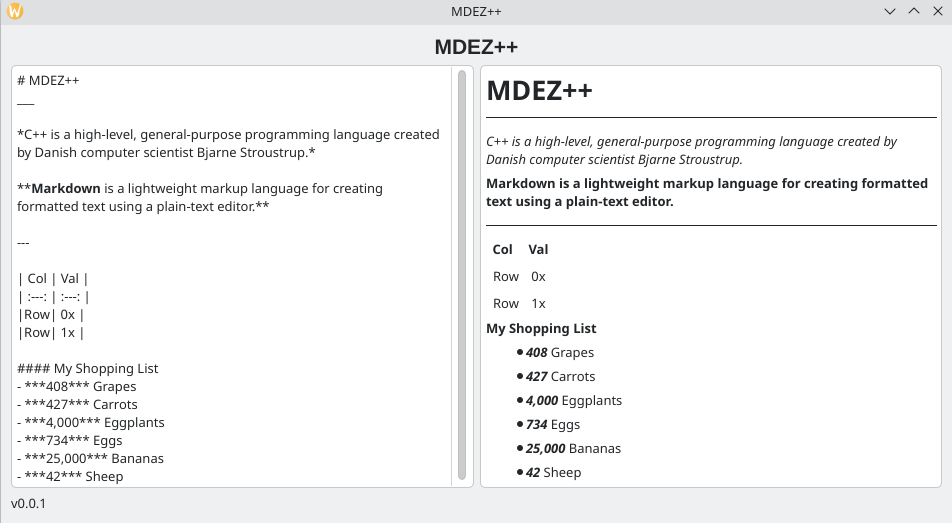

# MDEZ++

MDEZ++ is a lightweight Markdown editor written in C++ while using the Qt Graphical Framework.

[](https://github.com/tyleruploads/mdez/blob/main/LICENSE)
[](https://github.com/tyleruploads/mdez/issues)

[](https://isocpp.org/)
[](https://www.qt.io/)



## Usage

Simply type Markdown into the text entry on the left side of the screen, and it will automatically come out on the right side!

> **New to Markdown?** Check out this [cheat sheet](https://dev.to/thetylern/a-markdown-cheat-sheet-for-anywhere-32bp)!

### Keyboard Combinations
| Action | Shortcut | Description |
| :---: | :---: | :---: |
| Open File | `Ctrl / Cmd + O` | Open an existing document |
| Save As | `Ctrl / Cmd + Shift + S` | Save the current document under a new name or location |
| Save | `Ctrl / Cmd + S` | Save changes to the current document |

## Installation

Currently, no installation is required! All you need to do is download and open the appropriate binary for your operating system.

| Linux | Windows | macOS |
| :---: | :---:   | :---: |
| [MDEZ++-x86_64.AppImage](https://github.com/tyleruploads/mdez/releases/latest/download/MDEZ++-x86_64.AppImage) | [mdez-windows.zip](https://github.com/tyleruploads/mdez/releases/latest/download/mdez-windows.zip)| Not Supported |

## Note for Linux Users

You must mark the AppImage as executable before it can be ran!

```bash
chmod +x MDEZ++-x86_64.AppImage
```

## Note for Windows Users

If you do not know what to do with the zip file, follow these steps.

1. Download [mdez-windows.zip](https://github.com/tyleruploads/mdez/releases/latest/download/mdez-windows.zip) and extract it
2. Open the extracted folder, navigate to build -> Release, and then run the file named `mdez-windows.exe` (the file extension may not be automatically shown for you)
3. If a SmartScreen window is displayed:
    + Click More Info under the text
    + Click the Run Anyway button at the bottom
    + Note: This is normal behavior for open-source software not signed with a commercial Microsoft developer key

<!-- Section: Features COMING SOON !-->

## Contributing

Contributions are what make open-source projects important. All contributions are highly appreciated

* **Found a bug or issue**: Open an Issue and show the output of the script, the steps to reproduce it, and as much information as possible
* **Have an idea**: Open an Issue and explain your idea as much as possible, why you think it would be a good addition to the project, and any other important information.

## Security

For information on reporting security vulnerabilities in MDEZ++, see [SECURITY.md](SECURITY.md)

## License

This project is licensed under the MIT License - see the [LICENSE](LICENSE) file for more information.
